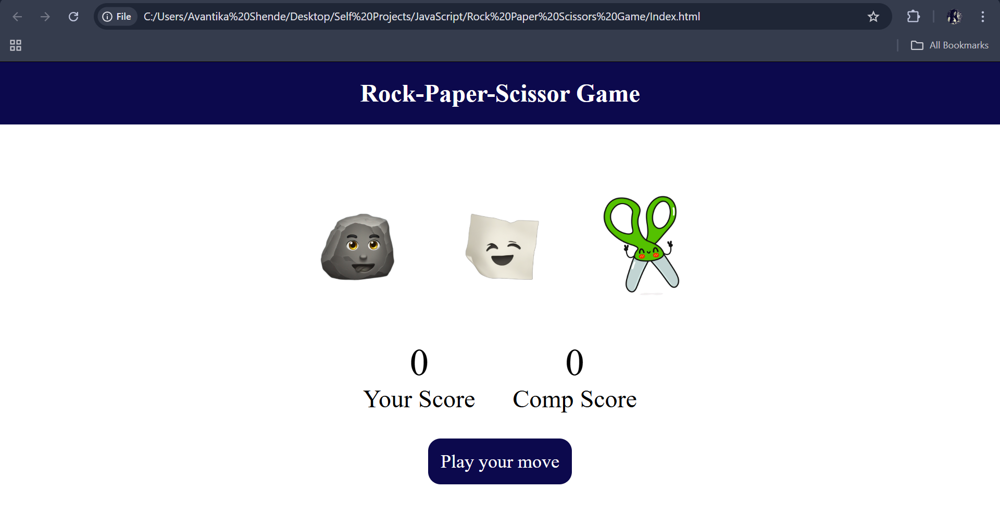
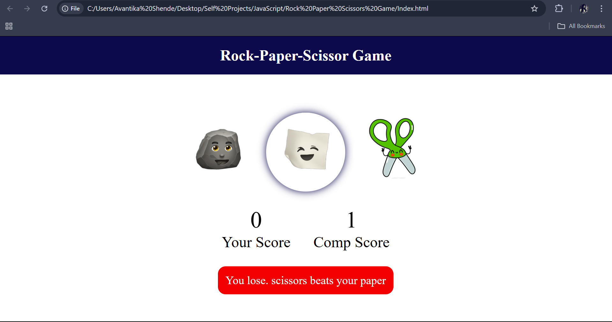
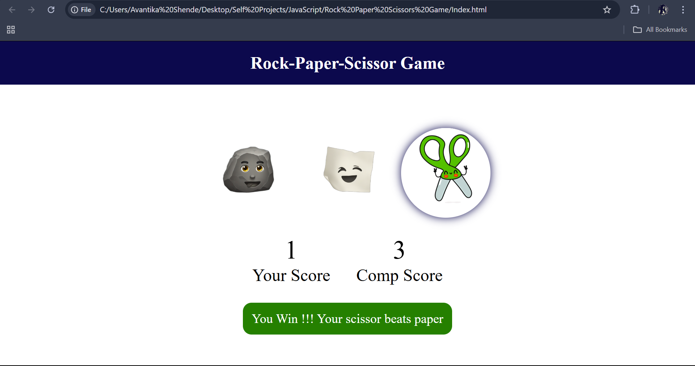
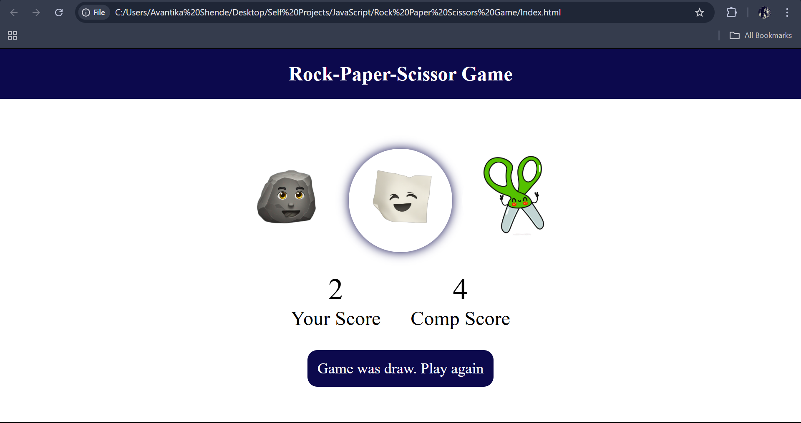
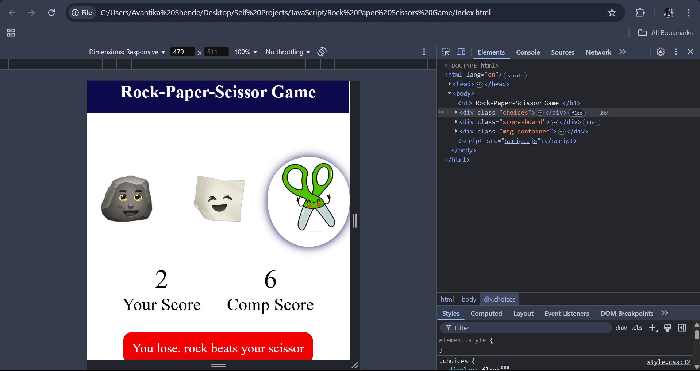

# ✊ Rock Paper Scissors Game  

## 📝 Overview  
This is a **Rock Paper Scissors** game built using **HTML, CSS, and JavaScript**. It is a simple yet fun project that demonstrates the use of event handling, conditional logic, and basic DOM manipulation.  

🔹 The player selects **Rock, Paper, or Scissors** to compete against the computer.  
🔹 The computer randomly selects its move.  
🔹 The game follows the standard **Rock Paper Scissors** rules to determine the winner.  

---

## 🎯 Features  
✅ **Random Computer Selection** – The game randomly generates the computer’s move.  
✅ **Win/Loss Detection** – Determines the winner and updates the UI accordingly.  
✅ **User-Friendly Interface** – Simple and interactive UI for smooth gameplay.  
✅ **Score Tracking** – Keeps track of wins, losses, and ties.  
✅ **Responsive Design** – Works on both desktop and mobile devices.  

---

## 📂 Project Folder Structure  
Below is the project structure:  

```
Rock-Paper-Scissors-Game/
│── index.html         # Main HTML file
│── style.css          # CSS styles
│── script.js          # JavaScript logic
│── images/            # Contains game images
│   ├── rock.png
│   ├── paper.png
│   ├── scissor.jpg
│── README.md          # Project documentation
```

---

## 🚀 Installation Instructions  

### 1️⃣ Clone this repository:  
```sh
git clone <repository-url>
```  

### 2️⃣ Navigate to the project folder:  
```sh
cd Rock-Paper-Scissors-Game
```

### 3️⃣ Open `index.html` in a web browser:  
```sh
start index.html   # Windows
open index.html    # macOS
xdg-open index.html # Linux
```

Alternatively, you can open it using **VS Code Live Server**:  
1. Install the **Live Server** extension in VS Code.  
2. Open the project folder in VS Code.  
3. Right-click on `index.html` and select **"Open with Live Server"**.  

---
## 🖼️ UI Preview

### 🎮 Game View


### 🏆 Winning Screens of User and Computer while storing scores  


---


---


### 🔄 View



## 🎨 JavaScript Features  
🔹 **Event Handling** – Click events for user selection.  
🔹 **Random Number Generation** – Used for computer's choice.  
🔹 **Conditional Logic** – Determines the winner based on game rules.  
🔹 **Dynamic UI Updates** – Displays results and updates score dynamically.  

---

## 🔮 Future Improvements  
🚀 **Enhance UI** – Add better animations and effects.  
🚀 **Sound Effects** – Include background music and selection sounds.  
🚀 **Multiplayer Mode** – Implement a two-player mode.  
🚀 **Leaderboard** – Track game history and player scores.  

---

## 👩‍💻 Author  
**Avantika Shende**  

---

## 📜 License  
This project is for educational purposes only and can be freely used and modified later.  
